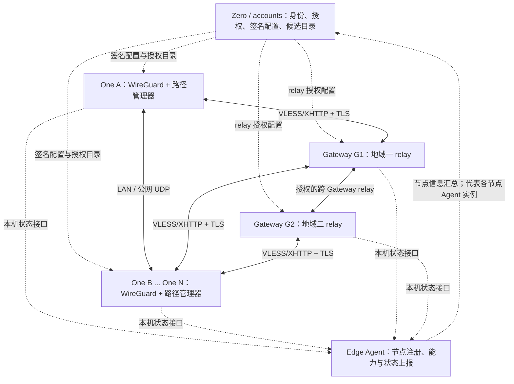
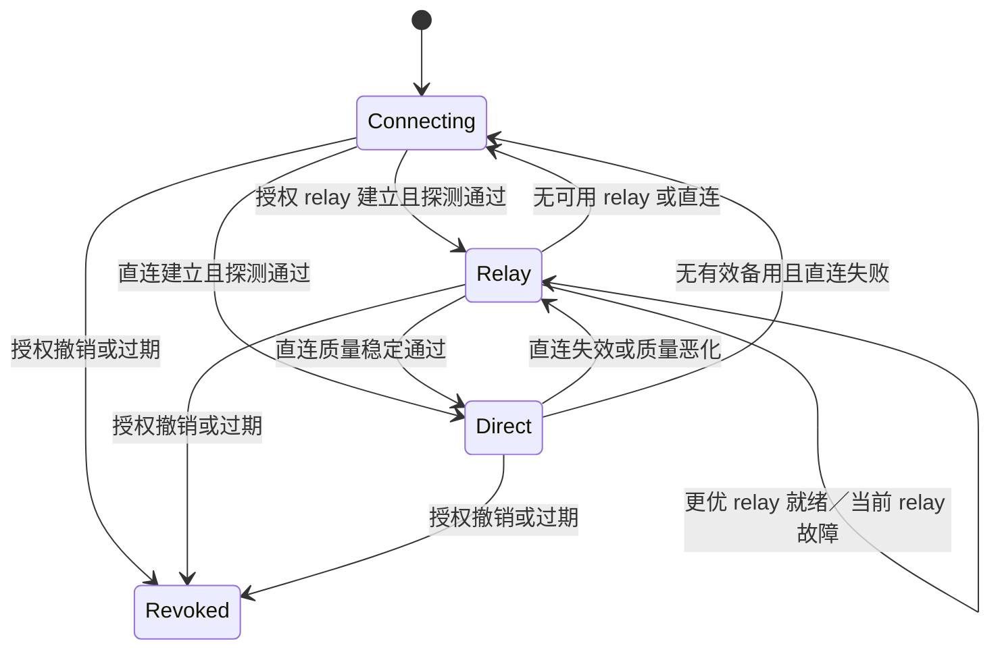

# XConnect 分布式 One 与多地域 Gateway 自适应网络架构设计

日期：2026-10-03（Asia/Shanghai）

状态：架构设计稿；包含本地源码现状核对与待实现规划。

范围：N 个 One、LAN／公网直连、WireGuard over VLESS relay、多地域 Gateway、Zero 控制面和 Edge Agent。

交付边界：本文只整理设计，不代表功能已开发、部署或通过线上验收。

## 1. 设计结论与已确定约束

XConnect 保留现有仓库分工，演进为身份和策略集中管理、数据路径由边缘节点自适应选择的网络。

- `xconnect-edge-agent` 保持节点侧注册、上报和控制面集成职责；管理 Gateway、One 与 Zero 的节点信息衔接。
- `XConnect-Gateway` 保持核心 relay，转发 One↔One 端到端 WireGuard 加密包；多地域场景可增加受控 Gateway↔Gateway 中继。
- `XConnect-One` 保持边缘节点，运行 overlay／WireGuard 和 One 路径管理器，负责发现、探测、路径选择与回退。
- Zero 是身份、授权和签名配置的权威；当前主要实现位于 `accounts`，Portal 提供管理入口。
- One 有 N 个，可以共享一个 LAN，也可以分布在家庭、企业、云主机、移动网络等具备公网出口的位置。
- Gateway 可以分布在不同地域、运营商和网络环境。地域只能辅助筛选，最终选择依赖完整路径实测。
- relay 优先使用 **WireGuard over VLESS**。首个明确承载 profile 为 **VLESS/XHTTP + TLS**，沿用现有 Xray 技术基础。
- LAN 和公网 UDP 直连仍是优先候选。VLESS 优先约束适用于 relay 承载，不表示所有业务必须绕 Gateway。
- 路径变化保持应用访问的 overlay IP 和对应 WireGuard peer 稳定；切换由路径管理器完成。

“最优路径”指当前授权、可达、已验证候选中符合业务质量要求的较优路径。系统持续更新判断，不承诺找到整个互联网的全局最优路径，也不承诺切换零丢包。

## 2. 术语与安全边界

| 术语 | 含义 |
|---|---|
| overlay | 应用访问的稳定虚拟网络地址空间 |
| underlay | LAN、互联网以及 relay 传输实际使用的物理网络 |
| One peer | 与本机建立端到端 WireGuard 隧道的已授权对端 One |
| 路径管理器 | 承接 WireGuard 加密包，选择直连或 relay 的模块 |
| Gateway relay | 按已认证会话转发加密包的服务 |
| 主要接入 Gateway | One 保持在线会话、接收连接请求的主要 relay |
| 业务 relay | 某一对 One 当前实际使用的中继；可以不同于主要接入 Gateway |
| 候选地址 | 可以尝试探测的地址；发现它不代表已认证或已可达 |
| 节点心跳 | 节点控制面存活信息；不能替代端到端数据面探测 |
| 配置 ACK | 节点对配置应用结果的确认；不能单独证明业务网络可用 |

目标数据面中，One A 和 One B 持有 WireGuard 私钥并完成加解密。Gateway 可以终止外层 VLESS/TLS 会话，但不终止这条 A↔B WireGuard 隧道。

Gateway 仍能看到连接来源、目标路由标识、包大小和时序等元数据。端到端加密不代表元数据不可见。

## 3. 当前实现快照

### 3.1 核对范围与证据等级

本节基于 2026-10-03 本地工作区源码与文档，未检查运行中的 One、Gateway 或 Zero，也未重新运行测试。

| 仓库 | 本地 HEAD 短 SHA | 核对说明 |
|---|---|---|
| `XConnect-One` | `8be2be4` | 源码核对；README、安装文档和安装脚本存在用户已有修改 |
| `XConnect-Gateway` | `4a88187` | 源码核对；README、安装文档和安装脚本存在用户已有修改 |
| `xconnect-edge-agent` | `22913bc` | 源码核对；核对时工作区无已报告修改 |
| `accounts` | `3b8369c` | 读取 overlay 配置生成相关源码；不作为完整仓库审计 |
| 工作区 `docs` | 尚无提交 | 独立 Git 仓库；本设计写入此仓库 |

本文中的“现有”表示存在相关代码或契约，不等同于当前发布版本或线上节点已经运行该能力。实施时应记录完整 commit SHA、不可变发布 tag 和实际运行版本。

### 3.2 当前 One↔Gateway 数据链路

```text
应用
  ↓ overlay IP
One WireGuard：peer 为 Gateway
  ↓ 本机 loopback UDP
One Xray
  ↓ VLESS / XHTTP / TLS，公网 TCP 443
Gateway Xray
  ↓ 转发到 127.0.0.1:51820
Gateway WireGuard：终止 One↔Gateway 隧道
  ↓ 授权私网／经网关转发到另一 One
```

当前 Gateway README 中的 relay 定位，具体实现仍包含本机 WireGuard 终止。它与本文规划的“只中继 One↔One 端到端加密包”需要区分。

### 3.3 One 当前限制

| 源码入口 | 核对结果 | 对目标架构的影响 |
|---|---|---|
| `overlay/signedconfig/contract.go`：`Validate` | peer 使用 `gateway_id`；endpoint 必须是 loopback | 尚未表达普通 One peer、直连候选和独立 relay 目录 |
| 同文件：`Compile` | 要求一个地址、一个 peer，报错语义为 single-gateway runtime | 签名结构有 peers 数组不等于运行时支持多 peer |
| `overlay/model/config.go`：`WireGuardConfig` | `PeerPublicKey`、`PeerAllowedIPs`、`PeerEndpoint` 为单 peer 字段 | 需要增加多 peer 运行时模型 |
| `overlay/runtime/desktop.go`：`renderWireGuardConfig` | 只生成一个 `[Peer]` | 无法直接建立 A↔B、A↔C 等端到端隧道 |
| 同文件：`renderXrayConfig` | loopback UDP 进入 dokodemo-door，再经 VLESS/XHTTP 出站 | 可以复用外层承载基础，但缺少端到端 relay 会话协议 |
| `overlay/policy/consumer.go`、`overlay/usecase/policy.go` | 验证策略引用、digest、generation、有效期并保存策略状态 | 已有策略消费基础；不能据此宣称解密后 ACL 执行完成 |

在核对的三个数据面／Agent 仓库 Go 源码中，未发现已接入本设计的 mDNS、STUN、magicsock 或路径管理器实现。此结论仅限本次搜索范围。

### 3.4 Gateway 当前实现

`internal/gateway/contract.go` 已包含签名 Gateway 配置校验、WireGuard peer 清单生成和 Xray profile 渲染。Xray inbound 路由到 `freedom` outbound，目标固定为 `127.0.0.1:51820`。

当前不是按目标 One 会话路由的透明加密包 relay。需新增会话注册、设备身份绑定、目标会话目录、转发封装和反向投递能力。

`cmd/xconnect-gateway/main.go` 已存在对现有接口使用 `wg syncconf` 的更新路径，可参考其避免重建接口的思路；它不证明新的多 peer 路径切换已经成立。

### 3.5 Edge Agent 当前实现

`internal/config/config.go` 已区分 `gateway`、`one`、`agent-proxy` 角色。

`internal/agentmode/runner.go` 明确：Gateway 和 One 的 WireGuard/Xray 由各自产品管理；Agent 在这两种角色下跳过 Agent Proxy 的 Xray 配置同步，继续认证和状态上报。

`internal/agentproto/types.go` 已有 role、node ID、network ID、region、pool、entry point 等上报字段。尚需扩展候选地址、relay 能力、真实运行状态、路径摘要、负载和有效期。

需要特别区分：当前报告中的 `Xray.Running` 根据同步 tracker 的成功时间推导，不能当成对 Gateway／One 数据面进程或业务链路的独立验证。

Gateway／One 当前仍有各自的 join、session、signed-config、ACK 生命周期。目标是统一节点注册和状态汇总职责，并非把已有设备凭据和签名校验全部迁移到 Agent。具体接口归属见第 6 节。

### 3.6 Zero 当前实现

`accounts/internal/overlay/service.go` 的 `buildSignedConfig` 当前按 network 的单个 Gateway 生成 One 配置：Gateway 公钥、network CIDR 的 AllowedIPs 和本机 endpoint。

同文件的 `GatewayConfig` 将 Gateway 设备与 network 的 `GatewayID` 绑定。多地域 relay 目录、一个 network 对多个 Gateway 的授权关系、按 One peer 的端到端配置，均需新增或版本化扩展。

现有控制面 transport 名称存在 `vless-tls-xudp` 与客户端 XHTTP 兼容处理；新设计应使用明确、版本化的 profile，避免靠名字推测实际协议。兼容修复和新 relay 协议是不同事项。

### 3.7 当前缺口总表

| 能力 | 当前证据 | 规划 |
|---|---|---|
| WireGuard over VLESS/XHTTP | 有渲染和配置链路 | 复用并验证 relay 会话承载 |
| One↔Gateway WireGuard | 有实现 | 兼容保留网关资源访问 |
| One↔One 端到端 WireGuard | 当前单 Gateway 编译路径不支持 | 多 peer 与稳定本机入口 |
| LAN 自动直连 | 本次未发现对应实现 | 候选交换、mDNS 补充、认证探测 |
| 公网直连 | 本次未发现对应路径管理 | IPv6、STUN／ICE 与 NAT 打洞 |
| 透明 Gateway relay | 当前送到本机 WireGuard | 新 relay 会话与转发服务 |
| 多 Gateway 自适应 | 当前配置绑定单 Gateway | relay 目录、协商、质量探测 |
| Gateway↔Gateway relay | 本次未发现对应实现 | 最多两个 Gateway 的受控中继 |
| One 数据面 ACL | 有策略消费基础 | 补齐解密后执行及实测 |
| 无感路径切换 | 无完整实现证据 | 保持 peer／IP，切换承载路径 |

## 4. 目标拓扑

### 4.1 控制面与节点职责



图中 Edge Agent 是各节点角色集成的抽象，不代表一个中心 Agent 汇聚所有节点进程。控制链路使用 HTTPS 等控制协议，业务数据不经过 Zero。

### 4.2 数据面三类路径

```text
直连：      One A WG ↔ PM A ↔ LAN／公网 UDP ↔ PM B ↔ One B WG
单 relay：  One A WG ↔ PM A ↔ VLESS ↔ G1 ↔ VLESS ↔ PM B ↔ One B WG
双 relay：  One A WG ↔ PM A ↔ VLESS ↔ G1 ↔ VLESS ↔ G2 ↔ VLESS ↔ PM B ↔ One B WG
```

PM 表示路径管理器。三种路径传输同一对 One 的 WireGuard 加密包，不在 Gateway 重新加解密内部业务数据。

双 relay 是条件能力：当双方没有共同可达 Gateway，或完整路径实测显示它明显更好时使用。若各 Gateway 之间也不可达，则该候选不成立；“有公网出口”本身不是连通性保证。

## 5. 仓库职责与模块归属

| 组件 | 应负责 | 不应混入的职责 |
|---|---|---|
| Edge Agent | 节点注册、身份映射、能力／健康／路径摘要上报，控制配置衔接 | 转发业务包、决定每次实时切换、覆盖 One／Gateway Xray 文件 |
| Zero / accounts | 网络与设备身份、授权、公钥绑定、签名配置、relay 目录、策略和候选可见范围 | 业务包转发、依赖中心服务完成每次路径切换 |
| Gateway | relay 会话、目标投递、跨 Gateway 转发、队列、限流、状态接口 | 冒充 One peer、解密端到端业务包、充当通用代理 |
| One | WireGuard 多 peer、路径管理、候选发现、认证探测、直连、relay 接入、ACL 执行 | 自行扩大授权范围、根据未认证发现信息信任设备 |
| Portal / App | 管理与观察路径，展示问题和诊断 | 持有设备私钥、要求用户手动选 Gateway 才能正常联网 |

共享协议模型可建立小型版本化包或 schema；禁止通过复制整个 Gateway／One 实现形成相互嵌套的职责。

## 6. 注册、上报和配置契约

### 6.1 双身份边界

节点上报身份与 overlay 设备身份必须区分：

- Agent 凭据允许上报已绑定节点的状态，不自动拥有修改 WireGuard 公钥、授权 peer 或代领任意设备凭据的权限。
- One／Gateway 的本地私钥和设备凭据继续由对应运行时安全持有。
- Zero 校验 `agent_id ↔ node_id ↔ device_id ↔ network_id ↔ role` 绑定；不能仅相信请求体自报字段。
- 将“Agent 负责注册上报”落实为统一节点信息入口和生命周期关联。现有敏感 enrollment、session、signed-config、ACK 可继续由 One／Gateway 执行；如通过 Agent 适配，也必须保留角色隔离和设备认证。
- 移动端／桌面端不要求运行 Linux systemd Agent。可复用仓库中的嵌入式上报模块或本地适配器，具体打包方式属于实施决策。

### 6.2 建议数据模型

以下为目标字段设计，不是已发布 API 或可直接加载的当前配置。

| 模型 | 关键字段 |
|---|---|
| NodeRegistration | node/device/network/agent ID、role、平台、运行版本、能力、认证绑定 |
| EndpointCandidate | candidate ID、设备、IP／host、port、地址族、来源、接口范围、observed_at、expires_at、network epoch |
| PeerAuthorization | 对端 device ID、公钥、overlay `/32` 或 `/128`、发现认证公钥、策略引用与有效期 |
| RelayDescriptor | 稳定 Gateway ID、独立 endpoint、TLS server name、profile、地域、能力、配置版本 |
| RelayAttachment | 设备当前可接收的 Gateway／session、session epoch、有效期、备用接入 |
| PathPolicy | 允许的路径类型、VLESS 首选承载、候选上限、探测／切换参数、最大 Gateway 数 |
| PathStatus | peer、活动路径、Gateway 序列、传输 profile、RTT／丢包、切换时间和原因 |
| GatewayHealth | 接受新会话状态、会话数、队列／带宽摘要、版本、heartbeat 时间 |

授权和目录由 Zero 签名；动态候选／attachment 使用认证的更新与来源绑定。授权有效期、候选地址有效期、会话有效期分开管理。地址变更不应触发全网络 ACL 重签或重建所有 peer。

LAN 地址只分享给允许发现该设备的 peer。不要在公开 mDNS TXT 中携带凭据、完整授权列表或长期敏感身份资料。

### 6.3 本机状态接口

One 和 Gateway 提供受访问控制的 Unix socket、本机 pipe 或受保护 loopback API；Edge Agent 读取真实运行状态，再上报 Zero。

接口应能区分进程存活、配置已应用、relay 会话在线、端到端路径可用，不能以一个 `healthy=true` 混合表示。高频探测结果先在运行时聚合，上报摘要和重要变化。

## 7. One 多 peer 与稳定加密边界

### 7.1 WireGuard peer 映射

每个授权 One 对端对应端到端 WireGuard peer，并绑定其 overlay 地址。路径切换不把该 `/32` 或 `/128` 在 Gateway 公钥和 One 公钥之间来回迁移。

如保留 Gateway 资源访问，可保留 Gateway WireGuard peer，但必须处理重叠 AllowedIPs 和路由优先级，明确 One 精确地址由端到端 peer 接管。未授权 peer 不得因 Gateway 的宽网段路由获得意外通行。

删除 peer、撤销权限和端到端密钥轮换属于安全状态变化，与普通路径切换分开执行。

### 7.2 首版接入方式

优先沿用当前外部 WireGuard 运行时：为每个 One peer 分配独立、稳定的 loopback UDP endpoint，由路径管理器收发密文。

```text
WireGuard peer B → 127.0.0.1:port-B → PM 的 peer B 状态
WireGuard peer C → 127.0.0.1:port-C → PM 的 peer C 状态
```

返回包从同一 peer 对应的稳定 socket 交还 WireGuard，避免直连／relay endpoint 变化泄漏到 WireGuard peer 状态。socket 需受本机权限、归属和生命周期管理保护。

每 peer 一个 socket 是首版兼容实现选择，不是协议要求。未来如果采用可扩展 userspace WireGuard，可通过自定义 `conn.Bind` 或等效接口多路管理 peer；这需要另行验证性能、平台兼容和安全边界。

现有 One 运行时可能在 apply 时重启进程，因此新实现还需增加增量 peer 更新和路径状态热更新，不能只修改配置数组就宣称无感。

## 8. 自动发现与直连

### 8.1 LAN 发现

首版使用两种候选来源：

1. 控制面按授权范围交换本地接口地址和监听端口。
2. mDNS 补充本地发现；组播被隔离时仍可尝试控制面候选。

仅在物理／明确允许的 underlay 接口发布和探测，过滤 overlay、loopback、无关虚拟网卡；IPv6 link-local 候选必须保留正确的接口 scope。

同网段、同公网 NAT 出口、收到 mDNS 都不能单独证明同 LAN 可直连。企业 AP isolation、VLAN 和主机防火墙可能阻止通信。

### 8.2 身份绑定与认证探测

探测使用独立的发现密钥或 Zero 签发的短期凭据，与设备身份、公钥和 network 绑定。不要直接将 WireGuard 私钥当作通用签名私钥。

探测包含挑战 nonce、回应、有效期和 network epoch，防止重放。成功定义为双方均验证对端身份并确认收发可达；业务 WireGuard 握手继续承担隧道身份验证。

探测应基于与业务相同的 socket／实际路径，避免“探测端口能通，业务端口不能通”。未认证 UDP 输入需要限流，避免反射放大和伪造探测影响选路。

### 8.3 公网直连

后续增加 IPv6 global 地址、STUN 映射地址和 ICE 协商／NAT 打洞。STUN 只提供地址映射信息，不保证打洞成功，也不负责 relay 或设备授权。

可评估 Pion ICE 等成熟库，不必引入完整 WebRTC DataChannel 来传输 WireGuard 包。发现信令可以通过现有 relay 通道传递，Zero 继续管理授权。

UDP 不可用、NAT 类型限制或策略禁止直连时，保持 VLESS relay。网络切换和休眠恢复后重新收集候选并验证。

## 9. Gateway relay 协议与 VLESS 承载

### 9.1 协议分层

```text
应用 IP 包
  → One WireGuard 加密
  → XConnect relay 帧／会话
  → VLESS
  → XHTTP + TLS
  → 对端 Gateway／One
```

VLESS/XHTTP 提供外层承载；目标设备路由、在线会话、会话恢复、端到端探测与权限检查属于 XConnect relay 协议。单纯配置 Xray `freedom redirect` 不能完成这些能力。

建议定义 `relay_session_protocol=v1` 与 `transport_profile=vless-xhttp-tls-v1`，分别版本化。名称是规划示例，尚未落地。

### 9.2 会话操作与帧

relay 协议至少覆盖 REGISTER、READY、DATA、PROBE、PING/PONG、CLOSE、REVOKE／ERROR。会话认证需要绑定 Zero 授权的设备、network、Gateway audience、有效期和设备持有证明。

DATA 帧包含版本、类型、目标路由标识、session epoch、长度和 WireGuard 加密 payload。源身份由认证会话确定，不能由包头自报。跨 Gateway 场景还需保留可信的源身份链、路径标识和跳数限制。

转发封装不赋予目标访问权限；Gateway 仅允许授权的源到目标投递。端口／协议等细粒度业务 ACL 由 One 解密后执行。

两种承载适配需在技术验证中择一并固定：

- XUDP／UDP 模式：验证长驻双向映射、空闲保活、对端主动回包、包边界和会话隔离。
- 帧化双向流：在 VLESS 可承载的双向流中定义长度前缀和多路复用，明确最大帧、背压及队列语义。

首版避免同时实现多套 relay framing。若现有 XUDP 回包语义不能满足要求，可更换适配方式，但仍保持 WireGuard over VLESS 的承载约束。

### 9.3 Xray 与 Gateway relay 的接入

Gateway 新增本地 relay 服务入口。Xray 将新 profile 的流量投递给该服务，旧 profile 继续到本机 WireGuard。

如果 Xray 到 relay 的转发无法保留可信设备身份，则 relay 必须做独立应用层认证。不能以所有用户共用的 VLESS UUID 或 loopback 来源地址区分 One。

Gateway 为会话设置发送队列上限、速率／流量配额、空闲期限和最大 payload。过载应丢弃或拒绝并反馈，不允许无界缓存导致所有节点延迟增长。

### 9.4 传输约束

- 首选 VLESS/XHTTP + TLS；公网 TCP 443 是初始部署基线。
- TLS 必须验证证书和 server name；Caddy Unix/h2c 模式下 TLS 在 Caddy 终止，本机通道使用受保护 socket。
- 不把 XHTTP 自动等同于 QUIC；实际使用的 HTTP 版本和外层传输需记录并验证。
- TCP／可靠流承载可能产生队头阻塞，多个 peer 共享流时要验证相互影响；不能保证这种承载总比 UDP 快。
- 其他 relay 承载只有在签名策略显式允许时使用，不默认引入 QUIC、WebSocket 或 TURN 替代 VLESS。

## 10. 多 Gateway 发现、接入与协商

### 10.1 Gateway 目录

Zero 下发有限的授权 relay 目录，包括稳定 ID、独立地址、证书名、地域、传输能力、准入状态和有效期。

初始筛选可以参考地域、运营商、负载和策略；One 仍需探测实际 VLESS 连接。每个 Gateway 必须能被明确寻址，不能仅依赖一个随机负载均衡地址来定位目标会话。

负载均衡只能在会话亲和、共享目录或明确转发机制成立时使用。DNS／GeoDNS 可辅助发现，不作为每 peer 的实时选路器。

### 10.2 主要接入与备用

One 建立主要 Gateway 会话，可维护少量备用。一个 relay 连接多路承载不同 peer，避免为每对节点重复建立全部物理连接。

主要接入用于在线可达和连接协调；业务路径按 peer 单独决定。例如 A→B 使用 LAN，A→C 使用公网 UDP，A→D 使用 G2，A→N 使用 G1→G4。

### 10.3 单 Gateway 路径

A 和 B 交换各自可达候选，协商一个共同 relay，双方在该 Gateway 建立 READY 会话并完成端到端探测。

如双方原本位于不同主要接入 Gateway，可以由一方按需接入对端 relay，或双方接入第三个候选。Gateway 之间无需为这种单 relay 路径转发。

协商可通过认证 relay 信令通道完成。确定性决策者（例如按设备 ID 排序）协调候选与 path epoch；数据双向仍可临时使用不同有效路径，不能因双方未同时切换而停机。

## 11. Gateway↔Gateway 多地域中继

### 11.1 启用条件

双方没有共同可达 Gateway，但各自接入 Gateway 之间存在允许且可达的链路；或者双 relay 的完整路径质量持续明显优于其他候选。

本设计最多经过两个 Gateway。暂不构建任意多跳全球路由网络，以限制环路、状态规模和诊断复杂度。

### 11.2 会话目录与路由

Gateway 维护本地在线 session。远端 attachment 通过认证目录或受控联邦通道交换，包含 network/device、归属 Gateway、session epoch 和有效期。

Zero 发布互联许可、身份和拓扑范围；即时会话断开、撤销和目录失效由 Gateway 数据面处理。目录缓存命中不代表对端仍可投递，需要探测确认。

Gateway 间使用独立身份与最小授权的 VLESS/TLS 会话，复用连接多路转发。目标 Gateway 根据可信源上下文、network 和投递授权进行检查；禁止从任意 Gateway 接收自报身份的转发。

路径记录、最多两个 Gateway 的限制、session epoch 和过期检查共同防止循环与陈旧投递。Zero 或联邦链路故障时，已有有效授权可继续使用到期限，不能无限信任旧目录。

### 11.3 扩展方式

优先按需建立 Gateway 互联或复用配置允许的地域骨干。所有 Gateway 全连接会产生平方级连接关系，不作为默认要求。

Gateway 间 VLESS 互联必须验证双向包投递、反向主动发包、空闲恢复、流量隔离和队列压力。互联服务健康不能替代 A↔B 端到端健康。

## 12. 路径质量评估与“最优”选择

### 12.1 分层筛选

1. 策略过滤：身份、授权有效，路径类型和 relay 序列允许。
2. 可达过滤：双方会话 READY，实际业务承载可用。
3. 粗排：单段延迟、地域、容量等信息缩小候选数量。
4. 完整探测：测 A↔B、A↔G↔B 或 A↔Gi↔Gj↔B。
5. 稳定选择：比较平滑质量指标和切换成本，保留当前路径的稳定性。

正常条件下优先 LAN 直连，其次公网直连，再比较单／双 relay。持续丢包或明显劣化的直连可以降级，双 relay 也可在证据充分时优于单 relay。

### 12.2 完整路径探测

仅测 A→Gateway 的延迟会选错业务路径：

| Gateway | A↔G RTT | B↔G RTT | A↔B 经 G RTT 初步估算 |
|---|---:|---:|---:|
| G1 | 10 ms | 150 ms | 160 ms |
| G2 | 35 ms | 40 ms | 75 ms |
| G3 | 80 ms | 15 ms | 95 ms |

两段 RTT 相加只用于粗排，最终以经过实际 VLESS relay 的端到端认证探测为准；双 Gateway 候选亦如此。探测须能指定候选路径，不能全部被当前活动路径送走。

### 12.3 初始质量模型

可以使用带归一化的成本模型，数值越低越好：

```text
cost = w_rtt  × normalized(smoothed_rtt)
     + w_loss × normalized(loss_rate)
     + w_jit  × normalized(jitter)
     + w_q    × normalized(queue_delay)
     + path_policy_penalty
     + switch_penalty
```

不同单位的原始指标不能直接相加。没有观测到的吞吐或丢包不是零；不足样本应降低置信度。初版可以先实现 RTT、丢包与防抖，避免把所有指标一次纳入复杂算法。

交互与大流量业务目标不同。首版按 peer 选择单一路径，采用统一质量策略；未来按流选路须保证同一流的路径粘性。吞吐以真实业务反馈或受控测量评估，不持续对所有候选压测。

## 13. 路径状态机与故障恢复

每个 peer 维护活动路径、候选集合、备用路径、network epoch、质量窗口和最近切换原因。



切换采用先建立新路径，再切发送出口。过渡期接受仍有效的旧／新路径回包，授权撤销的旧路径立即关闭。

正常升级要求连续成功、质量优势和稳定窗口；故障回退不等待性能升级窗口。双方临时发送路径不一致是允许的，前提是两条路径都能正确接收并投递同一 peer 的加密包。

| 事件 | 动作 |
|---|---|
| 首次业务访问 | 使用已经就绪的路径，后台尝试更好路径 |
| 常用 peer | 预热直连／备用，减少首包 relay 绕行 |
| 没有业务流量 | 不直接判失败；以低频探测和会话状态判断 |
| LAN／公网直连失败 | 切至已验证 relay，继续退避探测 |
| Gateway 故障 | 使用备用 relay 或有效直连，刷新 attachment |
| Wi-Fi、地址、接口变化 | 增加 network epoch，丢弃陈旧候选并重新探测 |
| 休眠恢复 | 检查本机 socket、配置期限和会话，重建失效传输 |
| UDP 长期不可用 | 保持 VLESS relay，降低直连重试频率 |
| 授权撤销／过期 | 关闭 peer 和相关转发，不作为可用性回退问题处理 |

探测周期、超时、稳定窗口、改善阈值和备用数量均为版本化策略参数。本文不把未经测量的固定毫秒值当作产品 SLA。实现后应给出默认参数及不同网络下的恢复时间分布。

## 14. 会话稳定、MTU 与包顺序

- 路径切换不重建 overlay 接口、不修改应用地址、不迁移 peer 公钥。
- 首版每 peer 使用单一发送路径，允许多条有效路径接收；避免逐包负载均衡引入持续乱序。
- WireGuard 的重放保护和接收窗口不能当作可靠投递或任意乱序修复。切换期间尽量缩短旧路径排队和延迟包滞留。
- 控制帧可确认和重试；业务密文默认不由 relay 无界重传，避免叠加可靠传输和缓存造成拥塞。
- 统一保守的 overlay MTU，明确 relay 最大帧及各层封装开销；验证 IPv4、IPv6、大包和 PMTU 行为。
- 可靠流承载需要明确帧重组和最大缓冲。新路径 MTU 更小时不能只验证小包 ping。
- TCP 通常能通过重传容忍短暂丢包，但 UDP、实时音视频和超时敏感业务需要单独验证。

## 15. ACL、撤销与控制面故障

直连会绕过 Gateway，因此细粒度访问策略必须在接收端 One 的 WireGuard 解密后入口执行，并绑定可信 peer 身份与 overlay 源地址。

现有 policy consumer 可复用签名引用、digest、generation、过期和防回滚校验。后续需选择并实现具体执行点，例如系统防火墙或 userspace 包过滤；各平台应保证等效行为，不能只保存策略文件。

Gateway 执行 network、源设备、目标设备和中继范围授权；由于内部包加密，不能依赖 Gateway 检查端口／协议细节。

撤销设计需要定义推送或轮询传播、缓存租约以及最大生效延迟。在线撤销到达时立即执行；离线节点只能通过有限有效期限制旧授权使用，不能承诺控制面断开时全球即时撤销。

Zero 暂时不可用时，继续使用最后可信且未过期的配置、目录和授权。不得接受新未授权 peer，也不得无限延长签名有效期。运行时必须能区别控制面故障与数据面故障。

私钥、设备凭据、VLESS 凭据和 TLS 私钥保留在受保护的运行时状态。日志、指标、文档、命令参数和配置示例不写入真实密钥；Gateway 间使用独立角色凭据。

## 16. N 个 One 与 M 个 Gateway 的规模控制

全量 peer 状态可能达到 `N×(N-1)`；全部 One 探测全部 Gateway 约为 `N×M`；所有 Gateway 全连接约为 `M×(M-1)/2`。三者均不应成为持续高频工作。

- Zero 按授权与候选范围裁剪目录，不向每个 One 推送整个全球网络。
- One 为活跃 peer 建立路径状态，对常用 peer 预热，空闲状态按 TTL 回收；首次访问如何触发 peer 建立需在实现时明确。
- 首版可以向小网络预配置授权 peer，后续增加按需激活，但不能因冷 peer 尚无路由而将首包错误送给宽网段 Gateway peer。
- 主要／备用 relay 连接在不同 peer 间复用，端到端身份和 WireGuard 密钥仍按 peer 隔离。
- 探测限定候选数量并使用随机间隔、退避、失败冷却；避免故障后所有节点同时重连。
- Zero 不收集每个探测包，只接收摘要和重要事件；高频 peer 指标以本机诊断或采样保存。
- Gateway 会话目录有期限、队列有上限，过载准入与已建立会话健康分开表示。

## 17. 可观察性与用户体验

One 对每个 peer 展示：活动路径、relay 序列、传输 profile、RTT、丢包、最后验证时间、最近切换原因和配置／策略 generation。

路径类型建议为 `direct_lan`、`direct_wan`、`relay_single`、`relay_federated`。它们是规划状态值，不能提前当作现有 CLI 输出。

```text
peer B：direct_lan，RTT 2 ms
peer C：direct_wan，RTT 28 ms
peer D：relay_single，G2，VLESS/XHTTP/TLS，RTT 75 ms
peer N：relay_federated，G1 → G4，VLESS/XHTTP/TLS，RTT 110 ms
```

以上为展示示例，不是实测结果。

Gateway 记录会话建立失败、认证拒绝、投递失败、队列丢包、互联状态和转发流量。Zero 展示注册、上报、配置 ACK 与路径摘要，分别标识数据来源和时间。

监控指标避免将全部源／目标 peer 组合放入公共高基数标签，也不得包含凭据。日志包含安全的路径标识与原因码，支持追踪一次切换。

用户无需手动切换 IP、DNS、Gateway 或重新连接应用。高级诊断可以固定允许路径进行测试，但默认模式保持自动发现和自适应。

## 18. 最小实施范围与分阶段交付

### P0：基线与协议验证

核验现有 One↔Gateway 的签名配置、WireGuard 握手、双向业务、MTU、Xray profile 和实际版本。验证 VLESS/XHTTP 下 relay 双向会话，择定 XUDP 或帧化流适配。

出口：可复现的承载原型与协议决定；不能用现有 Gateway 本机 WireGuard 通路替代透明 relay 验证。

### P1：单 Gateway 的端到端 relay

- One 增加多 peer 模型、稳定 loopback 入口和路径管理器，先仅启用 relay。
- Gateway 增加已认证会话、目标路由、反向投递、期限和限流。
- Zero 增加版本化端到端 peer 授权与 relay profile。
- Edge Agent 增加角色运行时状态适配和真实健康摘要。
- One 补齐接收端 ACL；未完成之前不得开放会绕过原有权限的生产直连。

出口：A↔B 端到端 WireGuard 经 VLESS relay 双向通信，支持双方主动发包及 N 个 One 的身份隔离。

### P2：LAN 自动直连与回退

增加 LAN 候选交换、mDNS 补充、认证探测、直连 UDP、网络变化处理、防抖和备用 relay。路径切换不修改 peer 映射。

出口：同 LAN 自动升级；阻断 LAN 后回退；恢复后重新升级；ACL 一致。

### P3：多地域单 Gateway 自适应

Zero 下发多 Gateway 目录；One 维护主要／备用接入，按 peer 协商共同 relay，使用完整 VLESS 路径质量选择。

出口：Gateway 故障自动切换；不同 peer 可使用不同 relay；证明选路不只依据本机到 Gateway 的延迟。

### P4：公网直连

增加 IPv6、STUN／ICE、NAT 打洞以及跨网络恢复。此阶段与 P3 可按业务需求调整顺序，但不应影响已稳定的 VLESS relay 基线。

出口：验证可打洞与不可打洞网络，UDP 被阻止时保持 relay。

### P5：跨 Gateway relay

增加受控联邦链路、attachment 目录、可信源身份、最多两个 Gateway 限制和完整路径探测。

出口：双方没有共同可达 Gateway 时，经允许的 Gateway 互联建立端到端通信。如果要求首批交付就覆盖此场景，P5 必须纳入首批范围，不能以 P3 完成代替。

### 18.1 主要代码改动入口

| 仓库 | 当前入口 | 必要改动 |
|---|---|---|
| One | `overlay/signedconfig/contract.go` | 新版本 peer／目录／profile 校验、编译、签名契约 |
| One | `overlay/model/config.go` | 多 peer、稳定入口、路径策略模型 |
| One | `overlay/runtime/desktop.go` 及各平台 runtime | 多 peer 渲染、增量应用、路径管理生命周期 |
| One | `overlay/policy`、`overlay/usecase/policy.go` | 策略校验复用与真正的执行适配 |
| One | 新路径管理模块 | 候选、认证、直连、relay、探测、状态机 |
| Gateway | `internal/gateway/contract.go` | 旧 WireGuard profile 与新透明 relay profile 分离 |
| Gateway | 新 relay 模块及 CLI／service 生命周期 | 会话、投递、认证、队列、互联、状态接口 |
| Edge Agent | `internal/config`、`internal/agentproto`、`internal/agentmode` | 角色状态适配、注册绑定、候选／能力／状态摘要 |
| accounts | `internal/overlay/domain.go`、`service.go` 等 | 多 Gateway 授权模型、签名契约、目录与更新接口 |

模块名称和新接口路径需要实施时定稿。本文没有预先宣称不存在的 API 已可调用。

## 19. 兼容、发布与回滚

当前 One decoder 使用严格字段校验；现有 schema 中直接加入未知字段会导致旧客户端拒绝。因此必须采用能力协商与新 schema／media type，保留旧配置生成器和黄金签名向量。

不要把现有 v2 策略引用契约直接当作新 mesh 契约。新的 schema 编号需统一分配，服务端签名序列化与客户端验签共同升级。

部署顺序建议：控制面支持新旧协议 → Gateway 新 relay 服务 → Agent 上报适配 → One 小规模启用 → 验收后扩大。新服务与旧 Gateway 本机 WireGuard 路径使用独立入口／路由，避免影响现有资源访问。

回滚分两类：

- 数据面路径故障：在同一 One peer 下回退到其他直连／relay，保持端到端身份。
- 新功能整体回滚：由控制面生成仍有效、授权正确的旧 profile，协调关闭新 peer 并恢复旧 Gateway 模型；可能影响活动连接，不能描述为普通无感切换。

反回滚 generation 必须继续单调递增，不能为了功能回滚重放过期旧签名配置。

交付证据按 PR → 合并 → 不可变 release tag → UAT 部署 → 实际路径验收记录。每份证据包含 One／Gateway／Zero 版本、网络条件、profile 和测试时间。

## 20. 验收矩阵

| 场景 | 必须证明 |
|---|---|
| 同 LAN 两个 One | overlay 地址双向可用；路径为 LAN；测试流量不再经过 Gateway |
| 同 LAN N 个 One | 多 peer 并发隔离；各 peer 路径独立；无身份串扰 |
| mDNS 被阻止 | 控制面候选仍可尝试；无法直连时 relay 可用 |
| 同公网出口但 LAN 隔离 | 不误判直连；使用已验证路径 |
| 跨公网可直连 | IPv6／打洞成功，完整 WireGuard 业务正常 |
| UDP 全部被阻止 | VLESS relay 双向正常，后台探测退避 |
| LAN 中断与恢复 | 连续 TCP／HTTP 跨回退运行；记录中断时长；恢复后稳定升级 |
| 多地域 Gateway | 按完整路径选路；本机最近 Gateway 不一定被选中 |
| Gateway 故障 | 当前会话失效被识别；备用路径自动接管 |
| 没有共同 Gateway | 跨 Gateway relay 成立；若阶段未实现则明确标记未覆盖 |
| VLESS 空闲后主动回包 | A、B 各自主动发包均可到达；不能只验证请求／响应 |
| Wi-Fi／移动网络切换、休眠 | 候选和 epoch 更新；陈旧路径失效；新会话建立 |
| ACL 一致 | direct、单 relay、双 relay 对相同流量给出相同允许／拒绝结果 |
| 未授权／伪造设备 | 发现、会话和投递被拒绝；日志不泄露凭据 |
| 撤销与过期 | 验证在线传播与离线租约上界；旧会话不能无限继续 |
| MTU 与包大小 | 大包、IPv4／IPv6、实际 HTTP／吞吐测试通过 |
| relay 过载与慢消费者 | 队列受限、丢弃／拒绝可观测；不拖垮全部 peer |
| Zero 暂时故障 | 有效已授权连接可运行；过期后按规则停止 |
| 旧客户端与回滚 | 新旧契约兼容，灰度不会破坏旧服务 |

量化记录应包括 RTT 的 p50／p95、丢包率、受控吞吐、故障检测与恢复时间、切换次数、Gateway 转发字节变化、CPU／内存／socket 数。比较必须使用相同业务和网络条件。

注册成功、心跳正常、配置 ACK、WireGuard 握手、relay 可连接和真实业务验收分别记录，不合并成一个“成功”结论。

## 21. 实施前需要定稿的技术决策

以下事项不改变已确定架构，需通过代码验证和原型收敛：

1. VLESS relay 采用 XUDP 还是帧化双向流；Xray 如何与 relay 服务安全衔接。
2. 新签名契约版本、能力协商和动态目录／候选更新接口。
3. LAN 探测身份机制、独立发现密钥生命周期和候选隐私范围。
4. 各平台 WireGuard 多 peer 增量更新、loopback socket 归属及 ACL 执行点。
5. 主要／备用 Gateway 数量、探测预算、防抖和质量阈值。
6. Gateway 联邦目录、互联授权、撤销传播与可用性目标。
7. 首包与冷 peer 的按需激活方式，避免错误回退到旧宽网段 Gateway peer。

## 22. 行业参考与本地源码索引

### 22.1 行业参考

本方案参考现有实现的分层思路，不要求替换 XConnect 控制面或直接嵌入整套第三方产品。

- [Tailscale connection types](https://tailscale.com/docs/reference/connection-types)：UDP 直连与端到端 WireGuard 中继。
- [Tailscale DERP](https://tailscale.com/docs/reference/derp-servers)：加密包中继、发现消息与 home relay 目录。
- [Tailscale magicsock 源码](https://github.com/tailscale/tailscale/blob/main/wgengine/magicsock/magicsock.go)：在 WireGuard 传输接口下管理和改变路径；直接复用需评估内部依赖。
- [NetBird NAT 与 relay](https://docs.netbird.io/about-netbird/understanding-nat-and-connectivity)：P2P、NAT 穿透与中继分层；其原生 relay 传输不同于本文选定的 VLESS。
- [NetBird 多 relay 部署](https://docs.netbird.io/selfhosted/maintenance/scaling/high-availability)：独立 relay 地址、主要接入和访问对端 relay 的设计参考。
- [Nebula host discovery](https://nebula.defined.net/docs/guides/host-discovery/)：向目录服务报告本地候选地址；不要求仅依赖 mDNS。
- [ZeroTier protocol](https://docs.zerotier.com/protocol/)：LAN peer discovery、后台直连尝试与 relay 兜底的设计参考。
- [Pion ICE](https://github.com/pion/ice)：公网候选协商可评估的 Go 实现，不替代 XConnect 身份和授权。

上述官方资料在本次架构讨论中查阅；第三方产品行为可能随版本变化。XConnect 的 VLESS、双 relay 和选路策略是本文提出的设计，并非声称这些产品采用同一协议。

### 22.2 本地源码与现有文档

- [One 签名配置与编译](https://github.com/ai-workspace-xstream/xconnect-one/blob/8be2be4/overlay/signedconfig/contract.go)
- [One 运行时模型](https://github.com/ai-workspace-xstream/xconnect-one/blob/8be2be4/overlay/model/config.go)
- [One 桌面 WireGuard/Xray 渲染](https://github.com/ai-workspace-xstream/xconnect-one/blob/8be2be4/overlay/runtime/desktop.go)
- [One 策略消费](https://github.com/ai-workspace-xstream/xconnect-one/blob/8be2be4/overlay/policy/consumer.go)
- [One 策略保存](https://github.com/ai-workspace-xstream/xconnect-one/blob/8be2be4/overlay/usecase/policy.go)
- [One 控制面路由](https://github.com/ai-workspace-xstream/xconnect-one/blob/8be2be4/overlay/controlplane/routes.go)
- [Gateway 签名配置与 Xray/WireGuard 渲染](https://github.com/ai-workspace-xstream/xconnect-gateway/blob/4a88187/internal/gateway/contract.go)
- [Gateway 运行时生命周期](https://github.com/ai-workspace-xstream/xconnect-gateway/blob/4a88187/cmd/xconnect-gateway/main.go)
- [Gateway README](https://github.com/ai-workspace-xstream/xconnect-gateway/blob/4a88187/README.md)
- [Edge Agent 角色配置](https://github.com/ai-workspace-xstream/xconnect-edge-agent/blob/22913bc/internal/config/config.go)
- [Edge Agent 上报模型](https://github.com/ai-workspace-xstream/xconnect-edge-agent/blob/22913bc/internal/agentproto/types.go)
- [Edge Agent 运行与角色隔离](https://github.com/ai-workspace-xstream/xconnect-edge-agent/blob/22913bc/internal/agentmode/runner.go)
- [Zero overlay 模型](https://github.com/ai-workspace-services/accounts/blob/3b8369c/internal/overlay/domain.go)
- [Zero overlay 配置生成](https://github.com/ai-workspace-services/accounts/blob/3b8369c/internal/overlay/service.go)
- [现有 WireGuard over VLESS 架构文档](https://github.com/ai-workspace-xstream/xconnect-one/blob/8be2be4/docs/architecture/xconnect-zero-wireguard-over-vless.zh-CN.md)

源码链接固定到第 3 节对应 commit，便于 GitHub 项目任务引用和复核。Accounts 的实际远端仓库为 `ai-workspace-services/accounts`，本机 origin 配置仍为旧地址；本文未修改其远端配置。后续修改时同步更新现状、缺口与验收证据。
