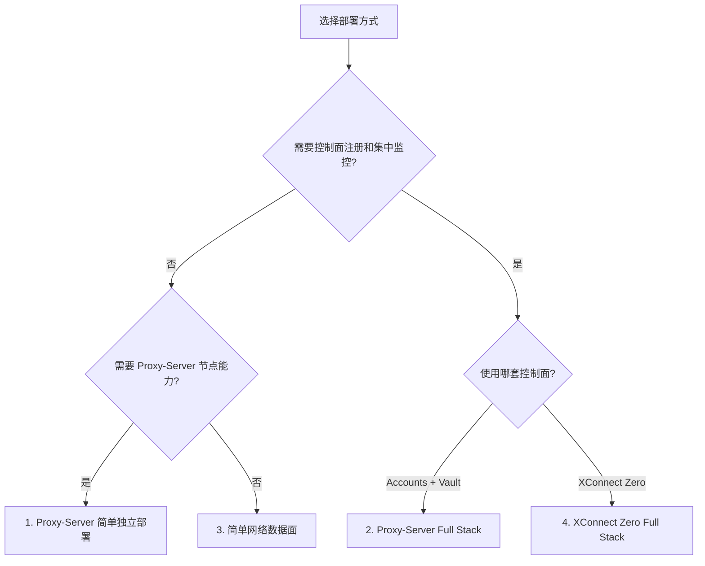

# XConnect / Proxy-Server 部署路线总览

日期：2026-10-03（Asia/Shanghai）  
状态：部署架构与运行手册  
范围：Proxy-Server 独立部署、Proxy-Server Full Stack、简单网络数据面、XConnect Zero Full Stack。  
验收边界：本文描述安装和验收路径，不代表任何特定节点已经完成线上部署或端到端验收。

## 1. 总体定位

XStream 体系包含两套控制面路线，以及一条不绑定特定控制面的简单数据面路线：

```text
Proxy-Server 体系
  ├─ 简单独立部署：Edge Agent / Caddy / Xray
  └─ Full Stack：Vault → Accounts → Edge Agent → Observability

XConnect Zero 体系
  ├─ 简单网络数据面：Gateway + One，控制面和凭据由外部流程提供
  └─ Full Stack：Zero Control Plane → Gateway + One → signed config / ACK
```

两套 Full Stack 的共同原则是：控制面负责身份、授权和配置；数据面负责 Xray、WireGuard、TLS 和实际转发；节点注册、服务 active 或一次握手都不能单独证明用户流量已经可用。

## 2. 术语和角色

| 名称 | 角色 | 主要职责 |
| --- | --- | --- |
| Proxy-Server / Edge Agent | 节点侧控制代理 | 同步节点和用户配置、上报心跳、管理 Xray 生命周期，并通过 Caddy 提供 TLS 入口。 |
| Accounts | Proxy-Server 控制面 | 维护节点、用户、订阅和 Agent API；节点通过 HTTPS 和服务凭据接入。 |
| Vault | 运行时密钥源 | 注入服务 Token、TLS 材料、监控凭据等短期运行时数据。 |
| XConnect Zero | Zero Trust 控制面 | 签发设备/Gateway 绑定的邀请、签名配置、会话和 ACK 契约。 |
| xconnect-gateway | Linux Server relay | 作为 XConnect Zero 的服务端 Gateway，处理加入、会话续期、配置同步和数据面应用。 |
| xconnect-one | 受控客户端 | 在 macOS、Linux、Windows 上管理本地 Xray/WireGuard 和设备状态。 |
| xconnect-app | 桌面/移动客户端 | 为 One 或受控客户端能力提供图形界面、节点管理和诊断。 |
| xray-exporter | 观测组件 | 将 Xray/V2Ray Stats API 和访问日志转为 Prometheus 指标。 |

## 3. 路线选择



| 路线 | 控制面 | 数据面 | 自动注册 | 自动监控 | 典型对象 |
| --- | --- | --- | --- | --- | --- |
| 1. Proxy-Server 简单独立部署 | 无集中控制面或 standalone | Caddy + Xray + Edge Agent | 否 | 否 | 个人单节点 |
| 2. Proxy-Server Full Stack | Accounts + Vault | Caddy + Xray + Edge Agent + exporters | 是 | 是 | 企业、多节点 Proxy-Server |
| 3. 简单网络数据面 | 手工或外部控制面 | Gateway + One + Xray/WireGuard | 否 | 否 | 手工搭建的网络连接 |
| 4. XConnect Zero Full Stack | XConnect Zero | Gateway + One + Xray/WireGuard | 是 | 以 Zero 状态、ACK 和数据面验证为准 | Zero Trust 全栈网络 |

## 4. 路线一：Proxy-Server 简单独立部署

### 4.1 适用范围

适用于一个域名、一台 Linux VPS、一个独立 Proxy-Server 节点。不依赖 Accounts、Vault 或集中式监控。

### 4.2 兼容安装入口

历史入口：

```bash
curl -fsSL https://raw.githubusercontent.com/cloud-neutral-toolkit/agent.svc.plus/main/scripts/setup-proxy.sh | \
  bash -s -- --node xhttp.example.com
```

该地址属于历史 `cloud-neutral-toolkit/agent.svc.plus` 路径，不是当前 `ai-workspace-xstream` 组织下的标准仓库入口。若继续保留，应单独审查脚本来源、Release、权限和版本固定策略。

### 4.3 当前 XStream 标准入口

普通节点：

```bash
curl -fsSL https://raw.githubusercontent.com/ai-workspace-xstream/xconnect-edge-agent/main/scripts/setup-proxy.sh | \
  bash -s -- --node xhttp.example.com
```

完全独立模式：

```bash
curl -fsSL https://raw.githubusercontent.com/ai-workspace-xstream/xconnect-edge-agent/main/scripts/setup-proxy.sh | \
  bash -s -- --node xhttp.example.com --standalone
```

### 4.4 脚本行为

脚本会根据目标节点执行依赖安装、Xray 安装、运行时制品下载、Caddy 配置、Edge Agent 配置、systemd 服务注册以及必要的网络设置。它不是“只下载一个 CLI”的安装器。

该路线不应宣称以下结果：

- Accounts 已注册当前节点；
- Vault 证书同步已经启用；
- 监控指标和日志已经进入 Observability；
- 用户侧数据面已经通过真实目标服务验收。

### 4.5 最低验收

```bash
systemctl is-active caddy xray xconnect-edge-agent
ss -lntp | grep -E ':(80|443|1443)\b'
curl -fsS https://<node-domain>/healthz
```

还应检查终端输出的节点配置能否在实际客户端导入，并完成一个真实目标服务请求。服务 active 或端口监听只能证明本机基础状态。

## 5. 路线二：Proxy-Server Full Stack 自建

### 5.1 目标架构

```text
Vault / Secret Manager
        │ runtime credentials
        ▼
Edge Agent ── HTTPS / service token ──► Accounts
    │                                      │
    ├─ Caddy + TLS                         ├─ 节点注册与状态
    ├─ Xray                                ├─ 用户/订阅配置
    ├─ Vault Agent                         └─ Agent API
    └─ Observability exporters ── Vector ──► Observability
```

### 5.2 前置条件

在同一个受保护的 root Shell 或 Vault Agent 运行环境中注入：

```text
AGENT_PROXY_DOMAIN
AUTH_URL
INTERNAL_SERVICE_TOKEN
VAULT_ADDR
VAULT_TOKEN
VAULT_TLS_SECRET_PATH
VECTOR_AUTH_USER
VECTOR_AUTH_PASSWORD
```

凭据不得放入命令参数、Shell 历史、Git、日志或监控标签。`VAULT_TOKEN` 只应具备读取所需 KV v2 路径的权限。

### 5.3 完整安装入口

```bash
curl -fsSL https://raw.githubusercontent.com/ai-workspace-xstream/xconnect-edge-agent/main/scripts/setup-proxy.sh | \
  bash -s -- --node "$AGENT_PROXY_DOMAIN" --with-observability
```

`--with-observability` 要求 Accounts 接入变量和监控写入凭据完整，否则脚本应在修改节点前失败退出。它不应与 `--standalone` 或 `--upgrade-only` 同时使用。

### 5.4 部署内容

- 从 Vault 读取或同步 TLS 证书和私钥；
- 安装或更新 Caddy、Xray、Edge Agent；
- 生成 `/etc/agent/account-agent.yaml`；
- 将节点注册到 Accounts 并同步配置；
- 配置 `xconnect-edge-agent.service`；
- 可选启用 Vault Agent 常驻证书同步；
- 安装 Xray Exporter、Node Exporter、Process Exporter、Blackbox Exporter；
- 通过 Vector 写入 Observability 的指标和日志入口；
- 上报节点心跳、健康状态和同步状态。

### 5.5 完整验收顺序

1. 确认 Vault 读取成功且凭据没有出现在输出中。
2. 确认 `vault-agent-tls`、`caddy`、`xray`、`xconnect-edge-agent` active。
3. 确认证书、监听端口和本地指标入口存在。
4. 确认 Accounts 收到当前节点的新心跳，而非仅仅看到旧记录。
5. 确认 Observability 收到当前节点的认证指标和日志写入。
6. 通过客户端完成一个真实的 Xray/HTTP 目标请求。

“服务 active”“日志写入成功”或“Accounts 有节点记录”均不能单独证明完整链路成功。

## 6. 路线三：简单网络数据面

### 6.1 适用范围

该路线只关注 Gateway 和 One 之间的网络数据面，不把 XConnect Zero 的注册、签名配置、会话管理和集中控制作为本次部署的一部分。配置、凭据和运行时可以由人工流程或其他控制面提供。

### 6.2 Gateway：仅 Linux Server

安装 Gateway CLI：

```bash
curl -fsSL https://install.svc.plus/xconnect-gateway | \
  sudo env XCONNECT_GATEWAY_VERSION=<approved-release-tag> bash
```

安装器会下载平台对应的 Release，并校验同版本 `SHA256SUMS`。它只安装 `/usr/local/bin/xconnect-gateway`，不会自动：

- 执行 Zero enrollment；
- 生成或读取长期邀请、TLS 私钥或 WireGuard 私钥；
- 安装 Xray 或 WireGuard；
- 启动网络服务。

### 6.3 One：macOS、Linux、Windows

Linux/macOS Shell 安装：

```bash
curl -fsSL https://install.svc.plus/xconnect-one | \
  sudo env XCONNECT_ONE_VERSION=<approved-release-tag> bash
```

Windows 使用仓库提供的 PowerShell 安装入口，不属于本节的 Shell 命令范围。

One 安装器只负责 CLI 制品安装和校验。Linux 会写入 `xconnect-one-sync.service`，但不会自动 enable/start，也不会自动完成加入网络和数据面启动。

### 6.4 数据面补充步骤

安装 CLI 后，仍需由部署者完成：

1. 为 Gateway 提供受信任的身份、TLS 和 WireGuard 配置。
2. 为 One 提供设备配置和客户端运行时。
3. 配置 Xray 的 VLESS/XHTTP/TLS 承载或其他批准的传输方式。
4. 启动 Gateway 和 One 的数据面服务。
5. 检查 WireGuard peer、最新 handshake、路由和真实目标请求。

因此，“安装脚本成功”不等于“简单网络数据面已经成功”。

## 7. 路线四：XConnect Zero Full Stack 自建

### 7.1 目标架构

```text
XConnect Zero Control Plane
  ├─ Device / Gateway identity
  ├─ Short-lived invitation
  ├─ Signed configuration
  ├─ Session renewal
  └─ ACK contract
           │
           ├──────────────► xconnect-gateway（Linux Server）
           │                  enrollment → relay config → WireGuard/Xray
           │
           └──────────────► xconnect-one（macOS/Linux/Windows）
                              enrollment → device config → local runtime
```

### 7.2 Gateway 注册流程

```text
安装 xconnect-gateway
  ↓
初始化受保护的 Gateway identity
  ↓
消费一次性邀请并 enrollment
  ↓
建立 Zero session
  ↓
获取并校验 signed Gateway config
  ↓
应用 WireGuard / Xray
  ↓
发送配置 ACK 和状态
  ↓
提供 Linux relay 数据面
```

Gateway 只支持 Linux Server。公网入口、TLS、WireGuard、Xray 和安全组应按 Gateway Runbook 单独配置；安装 CLI 本身不完成这些步骤。

### 7.3 One 注册流程

```text
安装 xconnect-one
  ↓
消费 XConnect Zero 一次性邀请
  ↓
注册设备身份
  ↓
建立 One session
  ↓
获取并校验 signed client config
  ↓
配置本地 Xray / WireGuard
  ↓
同步运行状态并发送 ACK
  ↓
验证 Gateway peer handshake 和业务目标
```

One 支持 macOS、Linux 和 Windows。不同平台的外部 Xray、WireGuard、权限模型和系统服务不同，但设备身份、签名配置和 ACK 契约应保持一致。

### 7.4 Zero Full Stack 的必要验收

必须同时具备以下证据：

- Gateway enrollment 成功且身份绑定到目标 network/Gateway；
- One enrollment 成功且设备身份有效；
- 当前 generation 的 signed config 验签成功；
- Gateway 和 One 均报告当前 generation 的 ACK；
- WireGuard peer 的最新 handshake 在验收窗口内更新；
- Xray/VLESS/XHTTP 数据面建立成功；
- 一个真实的 overlay 或授权私网服务返回预期响应。

以下现象不能单独作为成功证据：

- `systemctl is-active` 返回 active；
- 控制面存在设备记录；
- 有一次历史 handshake；
- 配置文件生成成功；
- ACK 成功但没有真实目标服务响应。

## 8. 安装命令与版本策略

### 8.1 版本必须显式固定

生产环境不要直接依赖未经审查的 `latest`。`xconnect-one` 和 `xconnect-gateway` 的安装命令应使用经过批准的 Release tag：

```bash
curl -fsSL https://install.svc.plus/xconnect-one | \
  sudo env XCONNECT_ONE_VERSION=<approved-release-tag> bash

curl -fsSL https://install.svc.plus/xconnect-gateway | \
  sudo env XCONNECT_GATEWAY_VERSION=<approved-release-tag> bash
```

安装器必须从相同版本路径获取：

```text
/<release-tag>/<asset>
/<release-tag>/SHA256SUMS
```

### 8.2 发布前核对项

- README 中的版本与安装脚本默认版本一致；
- `install.svc.plus` 托管脚本与仓库脚本来自同一审查版本；
- Release 中存在目标平台和架构制品；
- `SHA256SUMS` 包含目标制品；
- 安装器不会把 Token、私钥或邀请写入输出；
- Full Stack 模式的控制面 URL、Vault 路径和监控入口来自运行时环境；
- 完整验收记录 tag、commit SHA、目标主机、环境和验证结果。

## 9. 凭据和安全边界

### Proxy-Server Full Stack

- `INTERNAL_SERVICE_TOKEN` 只用于 Edge Agent 到 Accounts 的服务认证；
- `VAULT_TOKEN` 只在运行时存在，权限限制到所需 KV v2 路径；
- TLS 私钥只写入受保护的主机目录；
- 监控认证凭据不进入命令行、日志或 metric label；
- 生产环境不要把真实域名和凭据固化到公开脚本。

### XConnect Zero Full Stack

- 一次性邀请只消费一次，不写入 Git 或普通日志；
- Device/Gateway 私钥只保留在其所属的受保护状态目录；
- Signed config 必须检查签名、generation、过期时间、network 和角色绑定；
- Gateway 和 One 不直接访问控制面数据库；
- ACK 只表示配置应用确认，不表示业务 ACL 或目标服务已经可用。

## 10. 相关仓库

| 仓库 | 说明 |
| --- | --- |
| [xconnect-edge-agent](https://github.com/ai-workspace-xstream/xconnect-edge-agent) | Proxy-Server 节点侧 Agent 和组合式安装脚本 |
| [xconnect-gateway](https://github.com/ai-workspace-xstream/xconnect-gateway) | XConnect Zero Linux Gateway |
| [xconnect-one](https://github.com/ai-workspace-xstream/xconnect-one) | XConnect Zero 跨平台受控客户端 CLI |
| [xconnect-app](https://github.com/ai-workspace-xstream/xconnect-app) | 桌面和移动客户端 |
| [xray-exporter](https://github.com/ai-workspace-xstream/xray-exporter) | Xray/V2Ray Prometheus exporter |
| [accounts](https://github.com/ai-workspace-services/accounts) | Proxy-Server/Zero 相关控制面 API 参考实现 |
| [ai-workspace-xstream/.github](https://github.com/ai-workspace-xstream/.github) | 组织首页和项目入口 |

## 11. 最终判定

```text
安装完成
  ≠ 服务 active
  ≠ 节点已注册
  ≠ 有历史 handshake
  ≠ ACK 成功

完整成功
  = 控制面身份/配置正确
  + 本地服务 active
  + 当前 handshake 有效
  + 数据面真实可达
  + 用户目标请求返回预期结果
```

